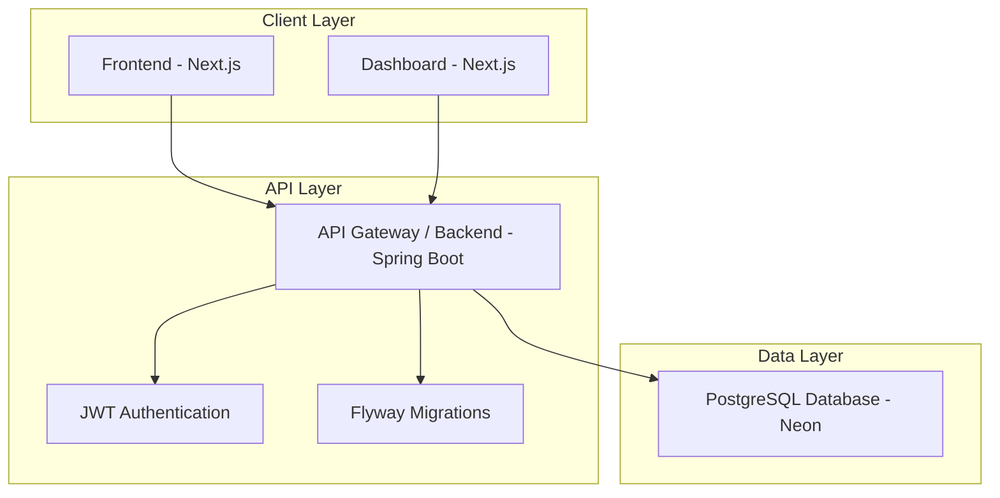

# Dakka Booking Platform

## Case Study: Modern Event Booking System

### 🎯 Executive Summary

Dakka Booking Platform is a comprehensive, full-stack event booking solution designed to streamline the reservation process for event spaces and services. Built with modern web technologies, it provides an intuitive user experience for customers while offering powerful management tools for administrators.

**Live Demo**: [https://dakka-booking-platform-pdfz.vercel.app/](https://dakka-booking-platform-pdfz.vercel.app/)

---

## 📋 Problem Statement

Traditional event booking systems often suffer from:
- Complex, outdated user interfaces
- Manual booking management processes
- Lack of real-time availability
- Poor mobile responsiveness
- Inadequate admin oversight tools

Dakka addresses these challenges by providing a modern, scalable platform that enhances both user experience and operational efficiency.

---

## 💡 Solution Overview

Dakka delivers a three-tier architecture comprising:
- **Public Frontend**: Customer-facing booking interface
- **Admin Dashboard**: Comprehensive management console
- **REST API Backend**: Secure, scalable service layer

### Key Innovations
- **Microservices-ready Architecture**: Modular design for future scalability
- **Real-time Calendar Integration**: Dynamic availability management
- **JWT-based Security**: Enterprise-grade authentication
- **Automated Database Migrations**: Reliable schema evolution
- **Responsive Design**: Seamless cross-device experience

---

## 🏗️ System Architecture



### Architecture Components

**Client Layer:**
- **Public Site**: Next.js application for customer bookings
- **Admin Dashboard**: Next.js application for management operations

**API Layer:**
- **Spring Boot REST API**: Core business logic and data processing
- **JWT Security**: Token-based authentication and authorization
- **Flyway**: Database version control and migrations

**Data Layer:**
- **Neon PostgreSQL**: Serverless database hosting
- **JPA Entities**: Object-relational mapping

---

## 🚀 Core Features

### Customer Experience
- ✅ Intuitive booking interface with package selection
- ✅ Interactive calendar with real-time availability
- ✅ Responsive design for all devices
- ✅ Secure user authentication
- ✅ Booking confirmation and management

### Administrative Capabilities
- ✅ Comprehensive dashboard with analytics
- ✅ User management and access control
- ✅ Booking oversight and status updates
- ✅ Real-time reporting and statistics
- ✅ Bulk operations for efficiency

### Technical Features
- ✅ RESTful API design
- ✅ Automated database migrations
- ✅ JWT token authentication
- ✅ Type-safe development with TypeScript
- ✅ Modern UI with Tailwind CSS

---

## 🛠️ Technology Stack

### Backend Architecture
| Component | Technology | Version | Purpose |
|-----------|------------|---------|---------|
| Runtime | Java | 17 | Core language |
| Framework | Spring Boot | 4.0.3 | REST API development |
| Security | Spring Security | - | Authentication & authorization |
| Database | Spring Data JPA | - | Data persistence |
| Database | PostgreSQL | - | Primary datastore |
| Hosting | Neon | - | Serverless PostgreSQL |
| Migrations | Flyway | - | Schema versioning |
| Auth | JWT | - | Token-based security |

### Frontend Stack
| Component | Technology | Version | Purpose |
|-----------|------------|---------|---------|
| Framework | Next.js | 16 | React framework |
| Library | React | 19 | UI components |
| Language | TypeScript | - | Type safety |
| Styling | Tailwind CSS | - | Utility-first CSS |
| Components | Material Tailwind | - | UI component library |
| Animations | GSAP | - | Smooth animations |
| Icons | Lucide React | - | Icon library |

---

## 📚 API Documentation

### Authentication Endpoints

#### POST `/auth/register`
Register a new user account.

**Request Body:**
```json
{
  "email": "user@example.com",
  "password": "securepassword",
  "phoneNumber": "+1234567890"
}
```

**Response:**
```json
{
  "token": "jwt-token-here"
}
```

#### POST `/auth/login`
Authenticate existing user.

**Request Body:**
```json
{
  "email": "user@example.com",
  "password": "securepassword"
}
```

**Response:**
```json
{
  "token": "jwt-token-here"
}
```

### Booking Endpoints

#### POST `/api/termine`
Create a new booking.

**Request Body:**
```json
{
  "name": "Wedding Reception",
  "hallOrLocation": "Grand Ballroom",
  "occasion": "WEDDING",
  "packageName": "Premium Package",
  "startDate": "2024-06-15T18:00:00",
  "endDate": "2024-06-15T23:00:00",
  "description": "Evening reception for 150 guests"
}
```

#### GET `/api/termine`
Retrieve all bookings.

**Response:** Array of booking objects

#### GET `/api/termine/{id}`
Get booking by ID.

#### PATCH `/api/termine/{id}`
Update booking details.

#### PATCH `/api/termine/{id}/status`
Update booking status.

**Parameters:**
- `status`: PENDING, CONFIRMED, CANCELLED, COMPLETED

#### DELETE `/api/termine/{id}`
Delete a booking.

---

## 🧪 Testing Strategy

### Backend Testing
- **Framework**: JUnit 5 with Spring Boot Test
- **Coverage**: Unit tests for service layers
- **Integration**: API endpoint testing

### Running Tests
```bash
cd backend
./mvnw test
```

### Test Structure
```
backend/src/test/java/
├── ApiApplicationTests.java    # Application context tests
└── [Additional test classes]
```

### Frontend Testing
- **Framework**: Jest + React Testing Library (planned)
- **Coverage**: Component and integration tests

---

## 🚀 Deployment & CI/CD

### GitHub Actions CI Pipeline

Automated CI/CD pipeline ensures code quality and reliable deployments:

```yaml
# .github/workflows/ci.yml
name: CI/CD Pipeline

on:
  push:
    branches: [ main, develop ]
  pull_request:
    branches: [ main ]

jobs:
  test-backend:
    runs-on: ubuntu-latest
    steps:
      - uses: actions/checkout@v4
      - name: Set up JDK 17
        uses: actions/setup-java@v4
        with:
          java-version: '17'
          distribution: 'temurin'
      - name: Run Backend Tests
        run: ./mvnw test

  test-frontend:
    runs-on: ubuntu-latest
    steps:
      - uses: actions/checkout@v4
      - name: Set up Node.js
        uses: actions/setup-node@v4
        with:
          node-version: '18'
      - name: Install Dependencies
        run: npm install
      - name: Run Tests
        run: npm test
      - name: Build
        run: npm run build
```

### Deployment Strategy
- **Frontend**: Vercel for static hosting
- **Backend**: Railway or Heroku for API hosting
- **Database**: Neon for managed PostgreSQL

---

## 📋 Prerequisites

- **Java 17** or higher
- **Node.js 18** or higher
- **npm** or **yarn**
- **PostgreSQL** database (or Neon account)

---

## 🔧 Installation & Setup

### 1. Clone Repository
```bash
git clone <repository-url>
cd dakka-booking
```

### 2. Backend Configuration
```bash
cd backend

# Environment variables
export PGHOST_UNPOOLED=<your-neon-host>
export POSTGRES_PASSWORD=<your-db-password>
export JWT_SECRET=<your-jwt-secret>
export PORT=8080

# Start application
./mvnw spring-boot:run
```

### 3. Frontend Setup
```bash
cd frontend
npm install
npm run dev
```

### 4. Dashboard Setup
```bash
cd dashboard
npm install
npm run dev
```

### Access Points
- **Public Site**: http://localhost:3000
- **Admin Dashboard**: http://localhost:3001
- **API**: http://localhost:8080

---

## 🗺️ Roadmap & Issues

### Current Version: v1.0.0

### Upcoming Features
- [ ] Mobile application (React Native)
- [ ] Payment integration (Stripe)
- [ ] Email notifications
- [ ] Advanced analytics dashboard
- [ ] Multi-language support
- [ ] API rate limiting
- [ ] Real-time notifications (WebSocket)

### Known Issues
- [ ] Calendar timezone handling
- [ ] Bulk booking operations optimization
- [ ] Image upload for venues

### Contributing to Development
Please see our [GitHub Issues](https://github.com/your-repo/dakka-booking/issues) for current tasks and feature requests.

---

## 🤝 Contributing

We welcome contributions! Please follow these steps:

1. Fork the repository
2. Create a feature branch (`git checkout -b feature/amazing-feature`)
3. Commit changes (`git commit -m 'Add amazing feature'`)
4. Push to branch (`git push origin feature/amazing-feature`)
5. Open a Pull Request

### Development Guidelines
- Follow existing code style
- Add tests for new features
- Update documentation
- Ensure all CI checks pass

---

## 📄 License

This project is licensed under the MIT License - see the [LICENSE](LICENSE) file for details.

---

## 📞 Support & Contact

- **Email**: support@dakka-booking.com
- **Issues**: [GitHub Issues](https://github.com/your-repo/dakka-booking/issues)
- **Documentation**: [API Docs](./docs/api.md)

---

**Built with ❤️ using Spring Boot, Next.js, and PostgreSQL**

*This case study demonstrates modern full-stack development practices, from architecture design to deployment automation.*

### Starting the Application
1. **Backend**: Runs on `http://localhost:8080`
2. **Frontend**: Runs on `http://localhost:3000`
3. **Dashboard**: Runs on `http://localhost:3001` (configure different port if needed)

### Accessing the Application
- **Public Site**: Visit `http://localhost:3000` to access the booking platform
- **Admin Dashboard**: Visit `http://localhost:3001` and sign in with admin credentials

## 📁 Project Structure

```
dakka-booking/
├── backend/                 # Spring Boot API
│   ├── src/
│   │   ├── main/
│   │   │   ├── java/com/Yassine/dev/api/
│   │   │   │   ├── ApiApplication.java
│   │   │   │   ├── security/          # Security configuration
│   │   │   │   ├── termine/           # Booking entities
│   │   │   │   └── user/              # User management
│   │   │   └── resources/
│   │   │       ├── application.yaml   # Configuration
│   │   │       └── db/migration/      # Flyway migrations
│   └── pom.xml
├── frontend/                # Next.js public site
│   ├── app/
│   │   ├── components/      # React components
│   │   ├── api/             # API routes
│   │   └── page.tsx         # Main page
│   ├── lib/                 # Utilities
│   └── package.json
└── dashboard/               # Next.js admin dashboard
    ├── app/
    │   ├── components/      # Dashboard components
    │   ├── auth/            # Authentication pages
    │   └── dashboard/       # Dashboard pages
    ├── lib/                 # Utilities
    └── package.json
```

## 🔐 Environment Variables

### Backend
- `PGHOST_UNPOOLED`: PostgreSQL host
- `POSTGRES_PASSWORD`: Database password
- `JWT_SECRET`: JWT signing secret
- `PORT`: Server port (default: 8080)

## 🤝 Contributing

1. Fork the repository
2. Create a feature branch (`git checkout -b feature/amazing-feature`)
3. Commit your changes (`git commit -m 'Add some amazing feature'`)
4. Push to the branch (`git push origin feature/amazing-feature`)
5. Open a Pull Request

## 📝 License

This project is licensed under the MIT License - see the [LICENSE](LICENSE) file for details.

## 📞 Support

For support, email support@dakka-booking.com or create an issue in this repository.

---

Built with ❤️ using Spring Boot, Next.js, and PostgreSQL</content>
<parameter name="filePath">c:\Users\yassu\Dakka-booking\README.md